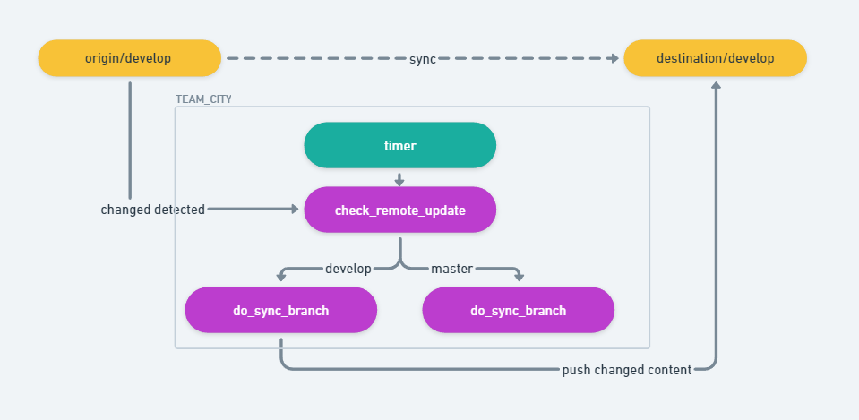

# fried_git_tools

Git scripts to solve real engineering problems. Tools to **sync two git repositories** with a large number of commits that would otherwise trigger **[unpacker error]** or other server-side limitations.

## Overview

When pushing a large number of commits to a Git server, you may encounter errors like:
- `[unpacker error]` - Server cannot unpack the large pack file
- Timeout errors - Push operation exceeds server timeout limits
- Pack size limits - Total pack size exceeds server configuration
- Merge commits are properly handled
- LFS objects are automatically synced one by one, preserving the entire history

This tool solves these problems by splitting commits into smaller batches and pushing them incrementally.

This tool may be used like this (TeamCity or Jenkins are optional; you may use the sync manually):


## Requirements

- **Python 3.x** (Python 3.6 or higher recommended)
- **Git** installed and available in your PATH
- **Git LFS** (optional, but recommended if your repository uses Large File Storage)
- **Dependencies**: Install required packages with `pip install -r requirements.txt`


## Installation

1. Clone or download this repository
2. Install dependencies: `pip install -r requirements.txt`
3. Ensure `run_command.py` is in the same directory as the main scripts
4. Make sure Python 3 is installed and accessible via `python3` or `py -3`
5. If your repository uses Git LFS, ensure Git LFS is installed and configured

## Main Scripts

### Brief Usage

* Use `init_git_sync_folder_gui.py` to set up an origin->destination sync folder; you may use a token in the URL to avoid authentication problems
* Use `git_sync_to_remote.py` to test the sync
* Use TeamCity integration to make the sync process run automatically

### git_sync_to_remote.py

#### Description

This script pushes git commits in batches to avoid server limits such as pack size limits or timeout issues when pushing many commits. If you encounter errors like **[unpacker error]**, this is the right tool.

#### Features

- **Batch Processing**: Splits commits into configurable batches (default: 50 commits per batch)
- **Safe Force Push**: Uses `--force-with-lease` by default to safely overwrite remote changes
- **Verification**: Automatically verifies each batch after pushing to ensure integrity by comparing commit logs
- **Debug Mode**: Preview commits before pushing each batch with interactive confirmation
- **Merge Commit Support**: Properly handles merged revisions and sub-commits that the shell script version cannot
- **Chronological Order**: Pushes commits in chronological order (oldest first)
- **Git LFS Support**: Automatically detects and fetches LFS objects for each batch before pushing
- **Log Caching**: Caches origin branch logs for efficient verification and comparison
- **Error Detection**: Advanced error detection with regex patterns to catch push failures early

#### Usage

```bash
python3 git_sync_to_remote.py <workspace_directory> [remote] [branch] [--debug] [--no-verify]
```

Or on Windows:

```bash
py -3 git_sync_to_remote.py <workspace_directory> [remote] [branch] [--debug] [--no-verify]
```

#### Parameters

- `workspace_directory` (required) - Path to the git repository
- `remote` (optional) - Destination remote name (default: `destination`)
- `branch` (optional) - Branch name to sync (default: `develop`)
- `--debug` (optional) - Enable debug mode (list commits per batch and require confirmation before each batch)
- `--no-verify` (optional) - Disable verification after each batch (default: verification enabled)

#### Examples

**Basic usage (default remote and branch):**
```bash
py -3 git_sync_to_remote.py /path/to/repo
```

**Specify remote and branch:**
```bash
py -3 git_sync_to_remote.py /path/to/repo destination 5.4
```

**With debug mode (preview commits before pushing):**
```bash
py -3 git_sync_to_remote.py /path/to/repo destination 5.4 --debug
```

**Disable verification (faster, but less safe):**
```bash
py -3 git_sync_to_remote.py /path/to/repo destination 5.4 --no-verify
```

#### Configuration

You can modify these constants in the script:

- `BATCH_SIZE` (default: 50) - Number of commits per batch
- `FORCE_PUSH` (default: True) - Enable force push with lease protection
- `SOURCE_REMOTE` (default: "origin") - Source remote name (always syncs from origin)

**⚠️ WARNING: FORCE_PUSH is set to true by default** - Make sure you **don't get the branch wrong** as it will overwrite the remote branch.

#### How It Works

1. Validates that the workspace is a valid git repository
2. Validates that both source and destination remotes exist and are configured
3. Prompts for confirmation if pushing to origin (safety feature)
4. Fetches the latest state from destination remote (source remote should be fetched manually beforehand)
5. Detects if Git LFS is enabled in the repository
6. Caches the origin branch log for verification purposes
7. Finds commits in origin that are not in destination (`origin..destination`)
8. Filters out graph symbols and sub-commits from merge commits
9. Splits commits into batches of `BATCH_SIZE`
10. For each batch:
    - If LFS is enabled, fetches LFS objects for commits in the batch range
    - Pushes the batch from origin to destination remote in chronological order
    - Uses `--force-with-lease` for safe force pushing (if enabled)
    - Fetches from destination to update local references
    - Verifies logs by comparing origin and destination commit logs (if verification is enabled)
11. Adds a 1-second delay between batches to reduce server load
12. Creates temporary log files in `workspace/temp/` for verification and debugging

#### Detailed Example: Mirroring Unreal Engine 5.4 Branch

If you want to mirror Unreal Engine 5.4 branch into your own git repository:

1. **Download the 5.4 branch into a folder:**
   ```sh
   git init --bare
   git remote add origin <SOURCE_REPO_URL>
   git config remote.origin.fetch "+refs/heads/5.4:refs/heads/5.4"
   # Optionally add other branches:
   # git config remote.origin.fetch "+refs/heads/master:refs/heads/master"
   ```

2. **Add your destination remote:**
   ```sh
   git remote add destination <DESTINATION_REPO_URL>
   ```

3. **Try a direct push (will likely fail with unpacker error):**
   ```sh
   git push destination +5.4:5.4
   ```
   This will likely fail with `[unpacker error]` if there are too many commits.

4. **Use the batch push tool instead:**
   ```sh
   py -3 ./git_sync_to_remote.py <workspace_directory> destination 5.4
   ```
   The script will split the commits into batches and push them incrementally.

#### Command-Line Options

- **--debug**: Enable debug mode
  - Lists all commits in each batch before pushing
  - Requires confirmation before pushing each batch
  - Useful for reviewing what will be pushed

- **--no-verify**: Disable per-batch verification
  - Skips the log comparison verification after each batch
  - Faster execution, but less safe
  - Verification compares origin and destination logs to ensure consistency

#### Prerequisites

- Make sure you have set up your git folder and it is **ready to push**
- Fetch the source remote manually before running the script (the script only fetches the destination remote automatically)
- You may want to create the branch on your server first to avoid unnecessary errors
- Ensure your remote URL has proper authentication embedded (e.g., token in URL)
- Both source and destination remotes must be configured
- The script will prompt for confirmation if you attempt to push to origin (as a safety measure)

#### Example: Setting Up a Branch to Sync

This example shows how to set up syncing when your destination server already has a branch with different content (e.g., a main branch with a README file).

Taking the master branch as an example, if your destination server already contains a main branch with a README, you need to align them first:

1. **Create a dual-remote structure** (similar to the Unreal Engine example above):
   - The source repo's remote is `origin`
   - The destination repo's remote is `destination`
   - For example, let's say the workspace is `/t/sync_workspace`

2. **Create a branch pointing to the first commit** of `refs/remotes/origin/master`:
   ```sh
   # Find the first commit hash
   git log --reverse --format="%H" refs/remotes/origin/master | head -1
   # Create a branch named origin_master_1 pointing to that commit
   git branch origin_master_1 <first_commit_hash>
   ```
   Replace `<first_commit_hash>` with the hash from the first command.

3. **Optional: Use a worktree for the initial force push** (recommended):
   ```sh
   git worktree add ../some_dir origin_master_1
   cd ../some_dir
   ```
   This step is optional, but it's better to perform the force push in a separate folder to ensure there are files and correct states for force pushing.

4. **Disable branch protection** in your GitLab/GitHub settings for the master branch (required for force push).

5. **Perform the initial force push** to align the branches:
   ```sh
   git push destination origin_master_1:master -f
   ```

6. **Return to the original folder** - it is now fully prepared for syncing:
   ```sh
   cd /t/sync_workspace
   ```

7. **Run the sync script**:
   ```sh
   py -3 git_sync_to_remote.py /t/sync_workspace destination master
   ```
   Now you can have a coffee and watch it do the work!

#### Troubleshooting

**Error: Remote 'destination' not found**
- Make sure you've added the destination remote: `git remote add destination <URL>`
- Check available remotes: `git remote -v`

**Error: Branch not found on remote**
- Create the branch on the destination remote first
- Or ensure the branch exists on both origin and destination remotes
- Note: If the destination branch is empty (0 commits) or has only 1 commit, the script will push all origin commits automatically

**Push fails with unpacker error even with batching**
- Reduce `BATCH_SIZE` further (try 20 or 10)
- Check for large files in recent commits
- Contact your git administrator about pack size limits

**Force push fails**
- The remote branch may have been updated by someone else
- Fetch and check: `git fetch destination`
- Consider using `--no-verify` if verification is causing issues (not recommended)

**Verification fails**
- This indicates the logs don't match between origin and destination
- Check if someone else pushed to the destination branch
- Review the mismatch details shown in the error output

---

### check_remote_change.py

#### Description

This script detects if branches on a git remote have changed by comparing current branch commit hashes with previously stored values. It's useful for monitoring remote repositories and triggering automated builds when changes are detected.

#### Features

- **Branch Change Detection**: Compares local and remote branch commit hashes
- **Two-Remote Comparison**: Can compare branches between two different remotes
- **TeamCity Integration**: Emits TeamCity parameters for CI/CD integration
- **Selective Branch Checking**: Limit checking to specific branches
- **JSON Output**: Provides structured JSON output for programmatic use

#### Usage

```bash
python3 check_remote_change.py <workspace_directory> --remote <remote_name> [options]
```

#### Parameters

- `workspace_directory` (required) - Path to the git repository
- `--remote` (required) - Name of the remote to check (e.g., 'origin', 'destination')
- `--second_remote` (optional) - If set, also compare the second remote against the first remote
- `--hint_teamcity` (optional) - Emit TeamCity parameters describing whether remote changed and a JSON with branch hashes
- `--limit_to_branch` (optional) - Limit branch checking to specified branches, separated by semicolon (e.g., 'master;develop'). Default is empty, which checks all branches.

#### Examples

**Check if branches on 'origin' remote have changed:**
```bash
python3 check_remote_change.py /path/to/repo --remote origin
```

**Check branches on 'destination' remote:**
```bash
python3 check_remote_change.py /path/to/repo --remote destination
```

**Compare two remotes:**
```bash
python3 check_remote_change.py /path/to/repo --remote origin --second_remote destination
```

**Check only specific branches:**
```bash
python3 check_remote_change.py /path/to/repo --remote origin --limit_to_branch "master;develop"
```

**With TeamCity integration:**
```bash
python3 check_remote_change.py /path/to/repo --remote origin --hint_teamcity
```

#### Output

The script outputs:
- Changed branches (local vs remote commit hashes differ)
- Branches not on remote (exist locally but not on remote)
- Unchanged branches (local and remote match)

When `--hint_teamcity` is used, it also emits TeamCity parameters:
- `env.git.remoteChanged`: "true" or "false"
- `env.git.remoteBranchesJson`: Base64URL-encoded JSON with branch information

---

### init_git_sync_folder.py

#### Description

A utility script to initialize a bare Git repository and configure it for branch synchronization. This is useful for setting up mirror repositories or preparing a workspace for syncing specific branches.

#### Features

- Creates a bare Git repository
- Configures remote with custom branch fetch specifications
- Supports multiple branches with explicit refspecs
- Can be re-run safely (skips existing configurations)
- Verification mode to check existing configurations
- Supports destination remote configuration

#### Usage

```bash
python init_git_sync_folder.py --repo-path <path> --remote-url <url> [options]
```

#### Parameters

- `--repo-path` (required) - Path where the bare repository should be created
- `--remote-url` (required) - URL of the remote repository (e.g., `ssh://git@example.com/repo.git`)
- `--remote-name` (optional) - Name of the remote (default: `origin`)
- `--branches` (optional) - List of branches to sync (default: `master`)
- `--no-fetch` (optional) - Skip the initial fetch operation
- `--verify-only` (optional) - Only verify existing configuration without making changes
- `--destination-remote-url` (optional) - URL of the destination remote repository
- `--destination-remote-name` (optional) - Name of the destination remote (default: `destination`)

#### Examples

**Basic usage:**
```bash
python init_git_sync_folder.py --repo-path /path/to/repo --remote-url ssh://git@example.com/repo.git
```

**Multiple branches:**
```bash
python init_git_sync_folder.py --repo-path /path/to/repo \
  --remote-url ssh://git@example.com/repo.git \
  --branches master develop release
```

**With destination remote:**
```bash
python init_git_sync_folder.py --repo-path /path/to/repo \
  --remote-url ssh://git@source.com/repo.git \
  --destination-remote-url ssh://git@dest.com/repo.git \
  --destination-remote-name destination \
  --branches master develop
```

**Verify existing configuration:**
```bash
python init_git_sync_folder.py --repo-path /path/to/repo --verify-only
```

#### How It Works

1. Creates a bare Git repository at the specified path
2. Configures the remote with the provided URL
3. Sets up branch-specific fetch refspecs for each specified branch
4. Optionally configures a destination remote
5. Optionally fetches from the remote to populate the repository
6. Verifies the configuration and displays available branches

---

### init_git_sync_folder_gui.py

#### Description

A GUI version of `init_git_sync_folder.py` that provides a graphical interface for initializing git sync folders. This makes it easier for users who prefer a visual interface over command-line tools.

#### Features

- Graphical user interface using Tkinter
- All features of the command-line version
- Real-time command preview
- Input validation
- File browser for selecting repository paths
- Browse for repository path
- Enter remote URLs and branch names
- Preview the command that will be executed
- Checkboxes for optional flags (--no-fetch, --verify-only)
- Destination remote configuration section

#### Usage

```bash
python init_git_sync_folder_gui.py
```

Or on Windows:

```bash
py -3 init_git_sync_folder_gui.py
```

---

### git_sync_to_remote.sh

#### Description

This is the legacy shell script version of `git_sync_to_remote.py`.

#### Limitations

- It can work in some repositories, but **fails to handle merged revisions** that `git_sync_to_remote.py` can handle properly
- The Python version is recommended for all use cases

#### When to Use

- Only use if you cannot run Python 3
- For simple linear histories without merge commits
- The Python version should be preferred in all cases

---

## TeamCity Integration

### Overview

The git_sync tools can be integrated with TeamCity for automated CI/CD workflows. This allows you to automatically detect remote branch changes and trigger builds accordingly.

### Components

#### check_remote_change.py

This script can emit TeamCity parameters when used with the `--hint_teamcity` flag:

```bash
python3 check_remote_change.py /path/to/repo --remote origin --hint_teamcity
```

It outputs:
- `env.git.remoteChanged`: "true" if any branch changed, "false" otherwise
- `env.git.remoteBranchesJson`: Base64URL-encoded JSON with branch comparison data

#### deploy_teamcity_sync_job.py

This script triggers TeamCity builds for each changed branch detected by `check_remote_change.py`.

**Usage:**
```bash
python3 -m teamcity.deploy_teamcity_sync_job \
  --changed <true|false> \
  --changed_json "<json>" \
  --teamcity_job_id <id> \
  --teamcity_token <token> \
  --teamcity_url <url>
```

**Parameters:**
- `--changed` (required) - "true" or "false" (case-insensitive). If not true, no builds are triggered.
- `--changed_json` (required) - JSON string with branch change information (from `check_remote_change.py`)
- `--teamcity_job_id` (required) - TeamCity build configuration ID to trigger for each changed branch
- `--teamcity_token` (required) - TeamCity Bearer token for authentication
- `--teamcity_url` (required) - TeamCity server URL

**Example:**
```bash
python3 -m teamcity.deploy_teamcity_sync_job \
  --changed true \
  --changed_json "eyJjaGFuZ2VkIjogeyJtYXN0ZXIiOiB7ImxvY2FsIjogImFiYyIsICJyZW1vdGUiOiAiZGVmIn19fQ==" \
  --teamcity_job_id MyBuildConfig \
  --teamcity_token YOUR_TOKEN \
  --teamcity_url http://teamcity.example.com:8080
```

### Workflow Example

1. **Set up a TeamCity build configuration** that:
   - Runs `check_remote_change.py` with `--hint_teamcity` flag
   - Captures the output parameters
   - Conditionally runs `deploy_teamcity_sync_job.py` if changes are detected

2. **Configure build steps:**
   ```bash
   # Step 1: Check for remote changes
   python3 check_remote_change.py %workspace.dir% --remote origin --hint_teamcity
   
   # Step 2: Trigger builds for changed branches (if any)
   python3 -m teamcity.deploy_teamcity_sync_job \
     --changed %env.git.remoteChanged% \
     --changed_json %env.git.remoteBranchesJson% \
     --teamcity_job_id MySyncJob \
     --teamcity_token %teamcity.token% \
     --teamcity_url %teamcity.serverUrl%
   ```

---

## Utility Functions

### git_sync_util.py

This module provides utility functions used by other scripts:

- **`sanitize_remote_url(url)`**: Masks authentication tokens in remote URLs before printing to prevent token leaks
  - Handles HTTPS, HTTP, SSH, and git+https URLs
  - Masks tokens while preserving URL structure
  - Safe to use in log output

- **`deep_merge(target, source)`**: Recursively merges source dictionary into target dictionary
  - Used for merging branch comparison results

### run_command.py

Core utility module for executing shell commands with proper error handling and logging:

- **`run_command()`**: Execute commands with real-time output
- **`run_command_and_get_return_info()`**: Execute commands and return output
- **`run_command_and_ensure_zero()`**: Execute commands and raise exception if return code is not zero
- **`ConsoleCommandLogger`**: Logger for separating command output from main process logs
- **`OutputCaptureLogger`**: Logger that captures output for regex error checking

---

## Git LFS Support

### Overview

The git sync tools have built-in support for Git LFS (Large File Storage). When LFS is detected, the tools automatically handle LFS objects during the sync process.

### Features

- **Automatic Detection**: Detects if Git LFS is enabled in the repository
- **Batch LFS Fetching**: Fetches LFS objects for each batch before pushing
- **Commit Range Detection**: Identifies commits containing LFS files within each batch
- **Individual Commit Processing**: Fetches LFS objects for each commit that contains LFS files

### Manual LFS Operations

If you need to fetch LFS files manually:

```sh
git lfs fetch origin <branch_name>
```

This ensures all LFS files are available locally before pushing.

### Configuration

- Your destination remote needs to have Git LFS configured separately
- The script cannot configure LFS for you
- Monitor for LFS-related errors and resolve them manually if needed

---

## Security Considerations

### Token Sanitization

The tools include built-in token sanitization to prevent credential leaks in logs:

- Remote URLs are automatically sanitized before printing
- Authorization headers are masked in debug output
- Always use `sanitize_remote_url()` when printing URLs

### Best Practices

- Never commit hardcoded tokens or credentials
- Use environment variables for sensitive data
- Review test files before committing (they may contain example tokens)
- Use the sanitization functions when logging sensitive information

---

## Troubleshooting

### Common Issues

**Error: Remote 'destination' not found**
- Make sure you've added the destination remote: `git remote add destination <URL>`
- Check available remotes: `git remote -v`

**Error: Branch not found on remote**
- Create the branch on the destination remote first
- Or ensure the branch exists on both origin and destination remotes

**Push fails with unpacker error even with batching**
- Reduce `BATCH_SIZE` further (try 20 or 10)
- Check for large files in recent commits
- Contact your git administrator about pack size limits

**Verification fails**
- This indicates the logs don't match between origin and destination
- Check if someone else pushed to the destination branch
- Review the mismatch details shown in the error output

**LFS objects not syncing**
- Ensure Git LFS is installed and configured
- Manually fetch LFS objects: `git lfs fetch origin <branch>`
- Check that the destination remote supports LFS

**TeamCity integration not working**
- Verify TeamCity token has proper permissions
- Check that the build configuration ID is correct
- Ensure the JSON format matches what `check_remote_change.py` outputs

---

## License

See [LICENSE](LICENSE) file for details.

## Contributing

Contributions are welcome! Please ensure your code follows the existing style and includes appropriate documentation.
